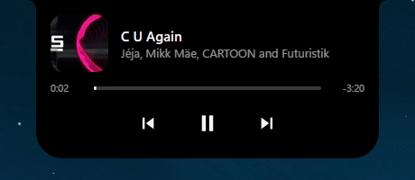
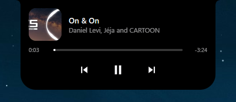

# Crest

<p align="center">
  
</p>

> **A personal hobby project**: something I wanted on my own desktop, so I built it. Works on my setup (Windows 11, YouTube Music in Brave); shared as-is, no support guaranteed.

A small black notch hanging from the top center of the screen. It shows what's playing in any player that appears in Windows' own media controls (built and tested with YouTube Music and Brave), grows when you hover or click it, and hides when there's nothing to show. Windows 11 first; Linux (KDE Plasma on Wayland) later.

Built with [Tauri 2](https://v2.tauri.app/): a Rust backend and a TypeScript + Vite frontend drawn with plain CSS/SVG. Everything stays on your machine: no telemetry, and no network calls unless you switch on an integration (there are none yet).

> Status: 0.3.1 is published ([download](../../releases/latest)). A compact notch (album art, title, playing bars) that springs open into a large view (art, title, artist, progress, previous/play-pause/next) on hover, click, or a new track; hides when the music has been paused for 30 s, the player closes, or a fullscreen app (a game, a video) covers its monitor. A settings window for starting with Windows, the monitor it sits on, and which players it shows. See `notes.md` for the running log.

Crest's tray icon (notification area, possibly behind the ^ arrow) has **Settings…** and **Quit Crest**. Starting Crest again while it runs also opens the settings.

## What it looks like

<p align="center">
  
</p>

Compact, it's a small notch with the album art, the title and bouncing bars; hovered or clicked (or when a new song starts), it opens into the player above, and it slides up into the screen edge when there's nothing to show.

<sub>Music in the demo: "C U Again" by Jéja, Mikk Mäe, CARTOON and Futuristik, and "On & On" by CARTOON and Jéja (feat. Daniel Levi), NCS releases, provided by [NoCopyrightSounds](https://ncs.io).</sub>

## What makes Crest different

- **Private by default.** Crest sends no telemetry and needs no account. It reads what's playing only from Windows' own media controls (SMTC): no scraping, no unofficial APIs, no cookies. Future integrations will be off until you switch them on, use free APIs only, talk to their own service only, and keep any keys in Windows Credential Manager (never in files).
- **Light on your PC.** Everything is event-driven, with no polling loops: 0% CPU while idle, paused or hidden, and about 5% of one core while music plays. While hidden, Crest asks WebView2 to keep as little in RAM as it can: about 16–32 MB in Task Manager (measured). The settings window only exists while it's open.
- **Built for Linux too (planned).** All Windows-specific code (media and window behavior) sits behind small interfaces, so a KDE Plasma on Wayland version can plug in next to it: MPRIS for media, layer-shell for the pill window. Not built yet.

## How it's built

I build Crest with [Claude Code](https://claude.com/claude-code) as my coding agent. I decide what Crest should do and how it should behave, test every change on my own setup, and report what I see; Claude Code writes the code, debugs and documents it, following the rules in `CLAUDE.md`. `notes.md` is the running log of every decision and bug, and the commit history shows which commits were co-authored.

## How it works, in plain language

Crest has two halves that talk to each other:

- **The backend (Rust, `src-tauri/`)** knows what's going on in the system: what music is playing, where the screen is, when to show or hide the pill.
- **The frontend (TypeScript, `src/`)** runs inside a small web view in the pill window and only draws what the backend tells it, and sends button presses back.

They talk through **Tauri events** (backend → frontend: "here's what to show now") and **Tauri commands** (frontend → backend: "the user pressed Next").

### Activities and sources (the plugin idea)

The pill always shows one **activity**: right now, "music is playing". Activities come from **sources**. Music is the first source; a timer or Claude Code events could be others later.

- Every source implements the same small Rust trait, `ActivitySource`. It reports updates ("this is what I'd show, this is how important it is, is it still ongoing?") and handles actions (like "next-track"). A button press travels as `(activity kind, action name)`; the `ActivitySourceRegistry` hands it to the source of that kind, and the result comes back as an ordinary update.
- The **core** (`activity_core/`) keeps the latest update from each source and decides what the pill shows and whether it's visible. It never looks inside a source's content, so adding a new source doesn't change the core.
- On the frontend, a small registry maps each activity kind (like `"music"`) to the views that draw it.

### When the pill is on screen

The core also decides visibility, with rules in one small pure function (`pill_visibility_policy.rs`, unit-tested):

- something **ongoing** (music playing) → visible, and it stays visible;
- something **lingering** (music paused) → hidden after 30 seconds; a new track shows it again first;
- **nothing** (the player closed) → hidden after 3 seconds;
- a **fullscreen app** covers the pill's monitor → hidden at once, without an animation, and back when it leaves. Crest learns this from the Windows shell, the same signal that hides the taskbar (`fullscreen_detection/`).

`pill_visibility_controller.rs` runs those countdowns and tells the frontend, which plays a short fade/shrink animation and then asks Rust to hide the native window (or shows the window first, then animates the pill in). A hide never happens while the mouse is over the pill.

### Media: one trait, one implementation per operating system

The music source doesn't talk to Windows directly. It uses a trait, `MediaSource`: "tell me when the current media session changes" and "play / pause / next / previous".

- **Windows** (`media/windows_smtc/`): uses the System Media Transport Controls (SMTC), the same system that feeds the media flyout next to the volume slider. Browsers publish what a web page plays there through the Media Session API, which is how we see YouTube Music without any unofficial API. A dedicated background thread waits for SMTC events (no polling), so it uses no CPU while nothing changes.
- **Linux, later** (`media/linux_mpris/`): a second struct implementing the same `MediaSource` trait over MPRIS, the D-Bus standard that Linux media players and browsers use. `media/mod.rs` picks the implementation for the current OS at compile time (`#[cfg(target_os = ...)]`), so nothing else in the app changes.

Which players the pill may show is a `MediaPlayerFilter`: every player, or only a list. The settings window changes it while the media thread runs, by sending it a message, so the pill follows at once.

### The window and the animation

The native window is always as big as the expanded pill (plus a little room for the spring's overshoot and the notch's curved shoulders), sits at the very top of the chosen monitor, and only moves when you choose another monitor. What changes is its **interactive area**: only the rectangle where the pill currently is takes the mouse; everywhere else, clicks go to the app below. Growing: the area widens first, then CSS animates the capsule. Shrinking: the capsule animates first, then the area shrinks. Resizing the real window during the animation would make the pill jump for a frame, because the web content re-lays itself out slightly after Windows resizes the window.

On the frontend, `pillStateMachine.ts` decides *when* the pill is compact or expanded (hover, leave, click, a new track), and `pillMorphController.ts` carries it out. Endless animations (the playing bars, the progress bar) run on slow timers (15 and 4 updates per second) rather than at the monitor's refresh rate; on a 240 Hz screen that is the difference between about 35% and 5% of a CPU core while music plays. Each activity kind provides a *view set* (a compact and an expanded view) through `activityViewRegistry.ts`, the frontend's plugin point.

### The settings window

A second window (`settings.html`), created when you open it and destroyed when you close it, so it costs nothing the rest of the time. It changes settings only through Crest's own Rust commands. `build.rs` lists every command, so Tauri makes a permission for each, and each window's capability file (`src-tauri/capabilities/`) grants only its own: the pill page can't change settings, and the settings page can't move the pill's window.

### Platform traits

Window behavior works the same way as media: a small trait, `PillWindowPlatform`, for "stay out of the taskbar and Alt+Tab", "show without taking focus" and "only this rectangle takes the mouse". `pill_window/mod.rs` picks the implementation for the current OS with `#[cfg(target_os = ...)]`. The Windows implementation sets Win32 window styles itself and shows the window with `SW_SHOWNOACTIVATE`, because Tauri's own `show()` would take focus. On Wayland a normal window can't place itself or stay on top, so KDE will get its own implementation (layer-shell) in `pill_window/linux_layer_shell/`.

## Current file tree

```
Crest/
├─ CLAUDE.md                    standing rules for AI-assisted sessions
├─ README.md                    this file
├─ LICENSE                      MIT
├─ dev-tools/                   debugging helpers, not part of the app (see dev-tools/README.md)
├─ docs/                        the demo GIF and screenshot shown in this README
├─ notes.md                     running project log
├─ .gitignore                   ignores node_modules, dist, build output
├─ .gitattributes               LF line endings everywhere (Windows and Linux)
├─ .claude/launch.json          dev-server config for Claude's preview pane (port 1420)
├─ .vscode/extensions.json      recommends the Tauri and rust-analyzer VS Code extensions
├─ package.json                 npm scripts and frontend dependencies
├─ tsconfig.json                strict TypeScript settings
├─ vite.config.ts               Vite dev server settings Tauri expects (fixed port 1420)
├─ index.html                   the page loaded into the pill window
├─ settings.html                the page loaded into the settings window
├─ src/
│  ├─ main.ts                   pill entry: wires the pill together, places it, then reveals the window
│  ├─ frontendConstants.ts      every size and delay (single source of truth; sent to Rust and CSS)
│  ├─ vite-env.d.ts             lets TypeScript understand Vite imports such as CSS files
│  ├─ ipc/
│  │  ├─ ipcChannelNames.ts     command, event and activity-kind names shared with Rust
│  │  ├─ listenForRustStateChanges.ts   receives Rust-owned state (listens, then asks once)
│  │  ├─ requestPillWindowPlacement.ts  asks Rust to size the window and put it at the top of its monitor
│  │  ├─ requestPillInteractiveArea.ts  asks Rust which rectangle takes the mouse
│  │  ├─ requestPillWindowReveal.ts     asks Rust to show the window without taking focus
│  │  ├─ requestPillWindowConceal.ts    asks Rust to hide the window
│  │  └─ requestActivityAction.ts       sends a button press to the activity's Rust source
│  ├─ pill/
│  │  ├─ pillShellElements.ts          the notch (with its shoulders), the capsule and its compact/expanded layers
│  │  ├─ pillDimensionCssVariables.ts  hands the sizes from frontendConstants.ts to CSS
│  │  ├─ pillStateMachine.ts           when to be compact or expanded (hover, click, peek)
│  │  ├─ pillPointerInput.ts           mouse events → state machine
│  │  ├─ pillMorphController.ts        animates a state change and keeps the interactive area in step
│  │  ├─ pillVisibilityController.ts   slides the notch in/out and shows/hides the native window
│  │  ├─ pillVisibilityTypes.ts        the visibility Rust sends (visible? fullscreen app in front?)
│  │  ├─ waitUntilNextFrameIsPainted.ts  resolves once the current content is on screen
│  │  └─ pillContentPresenter.ts       puts the current activity's views into the layers
│  ├─ activities/
│  │  ├─ pillPresentationTypes.ts    the shape of what Rust sends
│  │  ├─ activityViewSet.ts          what an activity's views must provide
│  │  ├─ activityViewRegistry.ts     activity kind → its view set (plugin point)
│  │  ├─ nothingToShowViewSet.ts     shown when no activity has anything
│  │  ├─ createSvgIconElement.ts     builds an inline SVG icon
│  │  └─ music/
│  │     ├─ nowPlayingTypes.ts       the music payload's shape
│  │     ├─ musicViewSet.ts          the music activity's compact + expanded views
│  │     ├─ compactMusicView.ts      tiny art, title, bars
│  │     ├─ expandedMusicView.ts     large art, title, artist, progress, buttons
│  │     ├─ albumArtImage.ts         album art with a placeholder when missing and a ring while loading
│  │     ├─ playbackBarsIndicator.ts bouncing bars while playing
│  │     ├─ playbackProgressBar.ts   position computed between updates; animates only when visible
│  │     └─ musicControlButtons.ts   previous / play-pause / next, dimmed when the player refuses one
│  ├─ settings/
│  │  ├─ settingsWindowMain.ts       settings entry: fills the cards
│  │  ├─ settingRowElement.ts        one row: title, explanation, control
│  │  ├─ launchAtLoginSettingRow.ts  "Start with Windows" switch
│  │  ├─ pillDisplaySettingRow.ts    "Show the pill on" monitor list
│  │  ├─ allowedPlayersSettingCard.ts  "Show every player", the player list, adding open players
│  │  └─ crestBuildDescriptionLine.ts  the About card: which Crest is running
│  └─ styles/
│     ├─ designTokens.css       every color, spacing, duration and the spring curve (pill and settings)
│     ├─ pillShell.css          transparent page, notch shape, the morph and slide animations
│     ├─ settingsWindow.css     the settings window, in the style of Windows 11's settings
│     └─ albumArtImage.css, compactMusicView.css, expandedMusicView.css,
│        playbackBarsIndicator.css, playbackProgressBar.css, musicControlButtons.css
└─ src-tauri/
   ├─ Cargo.toml                Rust package and dependencies (`windows` crate only on Windows)
   ├─ build.rs                  Tauri's build step; lists Crest's commands so each gets a permission
   ├─ tauri.conf.json           app name, pill window flags, content security policy, bundling
   ├─ capabilities/
   │  ├─ default.json           what the pill page may call
   │  └─ settings_window.json   what the settings page may call
   ├─ icons/                    app icons generated from crest-icon-source.svg (`npx tauri icon ...`)
   └─ src/
      ├─ main.rs                program entry; calls run_crest_app
      ├─ lib.rs                 wires the app: plugins, pill window, core, activity sources, commands
      ├─ backend_constants.rs   every Rust constant (windows, settings, priorities, timings)
      ├─ ipc_channel_names.rs   event, activity-kind and action names shared with the frontend
      ├─ user_settings_store.rs settings.json: loads it, keeps the current settings, saves safely (unit-tested)
      ├─ launch_at_login/
      │  ├─ mod.rs
      │  ├─ launch_at_login_switch.rs       "Start with Windows" on/off through tauri-plugin-autostart
      │  ├─ launch_at_login_repair.rs       at startup: puts the entry back if an update deleted it or it points at a removed Crest (unit-tested)
      │  └─ windows_run_key_registration.rs reads Windows' Run entry and whether its program still exists (unit-tested)
      ├─ system_tray.rs         tray icon with "Settings…" and "Quit Crest"
      ├─ activity_core/
      │  ├─ mod.rs
      │  ├─ activity_source.rs         trait every activity plugin implements
      │  ├─ activity_update.rs         what a source reports (priority, ongoing, attention key, payload)
      │  ├─ activity_publisher.rs      a source's handle for reporting to the core
      │  ├─ activity_arbiter.rs        picks what the pill shows and notifies the frontend (unit-tested)
      │  ├─ activity_source_registry.rs   running sources by kind; routes actions (unit-tested)
      │  ├─ activity_action_command.rs    command: a button press for some activity kind
      │  ├─ pill_presentation_command.rs  lets the frontend ask what's showing right now
      │  ├─ pill_visibility_policy.rs     the show/hide rules as a pure function (unit-tested)
      │  ├─ pill_visibility_controller.rs runs the hide countdowns, adds the fullscreen rule, reports changes
      │  └─ pill_visibility_command.rs    lets the frontend ask whether the pill is visible
      ├─ activity_sources/
      │  ├─ mod.rs
      │  └─ music/
      │     ├─ mod.rs
      │     ├─ music_activity_source.rs     media snapshots → music activity
      │     └─ session_loss_grace_period.rs ignores the short session gap on track change (unit-tested)
      ├─ media/
      │  ├─ mod.rs              declares the module; picks this OS's implementation
      │  ├─ media_source.rs     trait: watch media sessions, send play/pause/next/previous, hand out the filter control
      │  ├─ media_session_snapshot.rs  title, artist, album, art, play state, timeline, enabled buttons
      │  ├─ media_session_selector.rs  which allowed session to show (unit-tested)
      │  ├─ media_player_filter.rs     every player, or only a list; how list entries match (unit-tested)
      │  ├─ media_player_filter_control.rs  lets the settings window list players and change the filter
      │  ├─ media_app_identifier_label.rs   readable player names for the settings window (unit-tested)
      │  ├─ album_art_settle_gate.rs   holds a new track's art back 300 ms ("loading"), skipping placeholders (unit-tested)
      │  ├─ pending_transport_commands.rs  button presses kept while the session is briefly gone (unit-tested)
      │  └─ windows_smtc/
      │     ├─ mod.rs
      │     ├─ smtc_media_source.rs        Windows MediaSource: starts the worker thread
      │     ├─ smtc_worker_thread.rs       WinRT setup + the event loop
      │     ├─ smtc_worker_message.rs      what can wake the worker (events, button presses, a new filter)
      │     ├─ smtc_event_subscriptions.rs SMTC events → messages to the worker
      │     ├─ smtc_transport_commands.rs  play/pause, next, previous on a session
      │     ├─ smtc_session_tracker.rs     known sessions, last activity, what was sent, held presses
      │     ├─ smtc_tracked_session.rs     subscribes to every session; one listened-to session + lookup by app
      │     ├─ smtc_snapshot_reader.rs     WinRT properties → snapshot
      │     └─ smtc_thumbnail_reader.rs    album art → data URL, read fresh on every update
      ├─ fullscreen_detection/
      │  ├─ mod.rs
      │  ├─ fullscreen_app_watcher.rs     trait: tell me when a fullscreen app comes and goes
      │  └─ windows_shell_appbar/
      │     ├─ mod.rs
      │     ├─ appbar_fullscreen_app_watcher.rs   own thread + hidden appbar window that Windows notifies
      │     ├─ appbar_watcher_window_procedure.rs reacts to the fullscreen notification, a short settle timer, Explorer restarts
      │     ├─ appbar_watcher_thread_state.rs     what the window procedure needs, per thread
      │     └─ front_window_fullscreen_check.rs   does the front window cover the pill's monitor?
      ├─ pill_window/
      │  ├─ mod.rs              declares the module; picks this OS's implementation
      │  ├─ pill_window_platform.rs    trait: the OS-specific overlay behavior
      │  ├─ pill_window_placement.rs   top-center math in physical pixels on the chosen monitor (unit-tested)
      │  ├─ pill_display_choice.rs     chosen monitor or the main one; labels for the settings list (unit-tested)
      │  ├─ connected_display_reader.rs  the monitors Windows reports right now
      │  ├─ pill_interactive_area.rs   CSS pixels → physical pixels for the interactive area (unit-tested)
      │  ├─ pill_window_commands.rs    the commands the pill page calls
      │  └─ windows_native/
      │     ├─ mod.rs
      │     ├─ classic_frame_painting_blocker.rs  Win32 subclass: stops the classic title bar being painted (white bar)
      │     ├─ webview_memory_usage_target.rs     asks WebView2 to keep little in RAM while the pill is hidden
      │     └─ windows_pill_window_platform.rs  Win32: tool-window style, show without focus, hide, window region
      └─ settings_window/
         ├─ mod.rs
         ├─ settings_window_opener.rs    opens the window or brings it to the front (tray, second launch)
         ├─ settings_window_commands.rs  the commands the settings page calls
         ├─ crest_build_description.rs   version, release/dev, build time and path for the About card
         └─ allowed_player_options.rs    what the player card shows (unit-tested)
```

## Installing

Download `Crest_<version>_x64-setup.exe` from the [Releases](../../releases) page and run it (Windows 10/11, 64-bit). The installer isn't code-signed, so SmartScreen will warn: **More info → Run anyway**.

## Running it from source

Prerequisites on Windows: Rust (`stable-msvc`), Microsoft C++ Build Tools with "Desktop development with C++", Node.js. WebView2 ships with Windows 11.

```powershell
npm install
npm run tauri dev     # run with hot reload
npm run tauri build   # installer in src-tauri\target\release\bundle\nsis\
```

## Settings

Open them from the tray icon (**Settings…**) or by starting Crest again while it runs:

- **Start with Windows**: Crest starts in the background when you sign in. Off by default. Crest remembers your choice: Windows' installer removes the start-up entry when an update uninstalls the old version first, and Crest puts it back the next time it starts.
- **Show the pill on**: the main display, or a specific monitor. If that monitor is unplugged, the pill goes to the main display.
- **Allowed players**: which players the pill shows. A new install shows **every player**; switch that off to show only the list (it starts with YouTube Music), and add any player while it's open (a video in a normal browser tab counts as one player per browser, e.g. "Brave tabs"). With an empty list and the switch off, the pill shows no music.

The **About** card at the bottom shows which Crest is running (version, release or dev build, when it was built, and the file's location).

Changes apply at once and are saved in `%APPDATA%\dev.crest.pill\settings.json`, outside the install folder, so updates keep them (uninstalling removes them only if you tick "Delete the application data"). You don't need to edit the file; if you do, a list entry matches a player's exact app ID (ignoring case), except an entry starting with `_crx_`, which matches that web app in any Chromium browser:

```json
{
  "allowedMediaAppIdentifierFragments": ["_crx_cinhimbnkkghhklpknlkffjgod"],
  "showEveryMediaPlayer": false,
  "shouldLaunchAtLogin": false,
  "pillDisplayName": null
}
```

Before 0.3.0 entries matched any app ID that *contained* them, and an empty list meant every player. A file without `showEveryMediaPlayer` keeps that meaning for an empty list; a hand-written part of an ID (like `spotify`) now needs to be the full ID (`Spotify.exe`), which the settings window fills in for you.

## License

A personal hobby project. [MIT](LICENSE). Not affiliated with Google or YouTube; it only reads what Windows already shares through its media controls.
